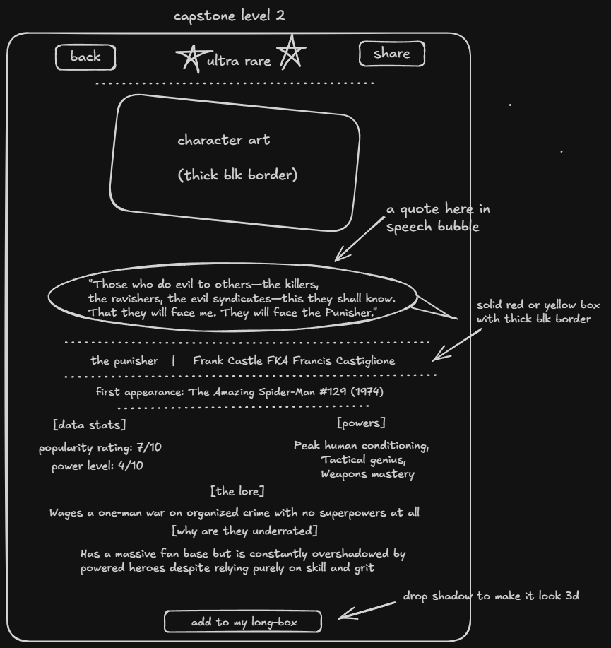

# The Overlooked & Overpowered: Marvel Edition

## The problem

A Marvel fan needs an easy way to discover overlooked characters because most fan content only covers the same handful of A-list heroes. My page will show one random underdog character at a time, along with a stat comparing how powerful they are versus how well-known they are.

## The plan

### Sections

1. Roulette
2. Rankings

### User input

Button clicks

### Outputs

 The applicable character from the dataset

## Data

Dataset: Marvel Underdogs
name,real_name,first_appearance,powers,popularity_score,power_level,notable_feat,why_underdog,powers_note
The Punisher,Frank Castle,The Amazing Spider-Man #129 in 1974,"[""Peak human conditioning"",""Tactical genius"",""Weapons mastery""]",7,4,Wages a one-man war on organized crime with no superpowers at all,Has a massive fan base but is constantly overshadowed by powered heroes despite relying purely on skill and grit,

1. Which underdog characters are the most powerful despite being the least popular?
2. How does a character's popularity relate to how long they've existed?
3. What's the most common power type among overlooked characters?

## Team

Accountability partners: https://github.com/lanettebethea; https://github.com/ALem1940; https://github.com/BabySodaCodex

## What Changed
Not much from my original plan had to be changed. One big thing is that I decided not to do a photo of each charater on the cards because of the volume needed along with the attributions. It was just too much work for my timeframe. I instead plugged in emojis that I felt embodied the character, and provided a link to each character's wiki page.

## Reflection
I had lots of fun with this project. I stressed with getting it done on time, but I think it's apart of the process. It's super awesome that I was able to do all the little thingd I wanted to do this go round. 